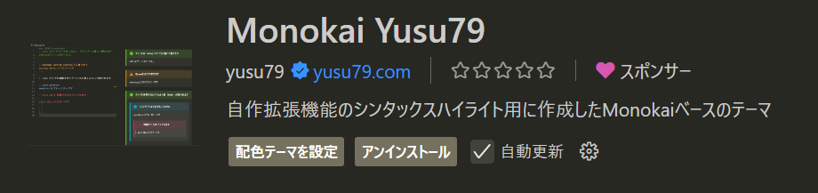

# Monokai Yusu79

Monokai Yusu79 is a custom theme based on the Monokai color scheme, designed for syntax highlighting in Visual Studio Code. This theme supports specific Markdown plugins to enhance the coding experience.

<!-- omit in toc -->
## Table of Contents
- [Installation](#installation)
- [Supported Syntax Highlighting](#supported-syntax-highlighting)

## Installation
To install the theme, search for "**Monokai Yusu79**" in the Visual Studio Code Marketplace.

## Supported Syntax Highlighting
The theme supports the following Markdown plugins:

| Plugin                                                                                   | Input Format                |
| ---------------------------------------------------------------------------------------- | --------------------------- |
| [markdown-it-info](https://www.npmjs.com/package/markdown-it-info)                       | `:::note info Title`      |
| [markdown-it-mojicolor](https://www.npmjs.com/package/markdown-it-mojicolor)             | `%Text%{Color}`                |

### markdown-it-info
This plugin generates an Info box when using the format `:::note info Title`. The theme customizes colors for each type of box.

### markdown-it-mojicolor
Using `%Text%{Yellow}` renders the text with the specified color, such as `Text`. The theme highlights symbols in orange.

