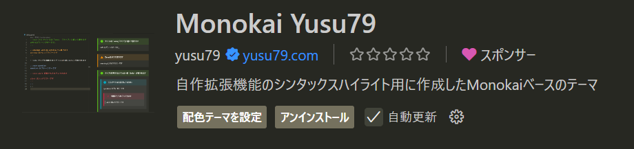
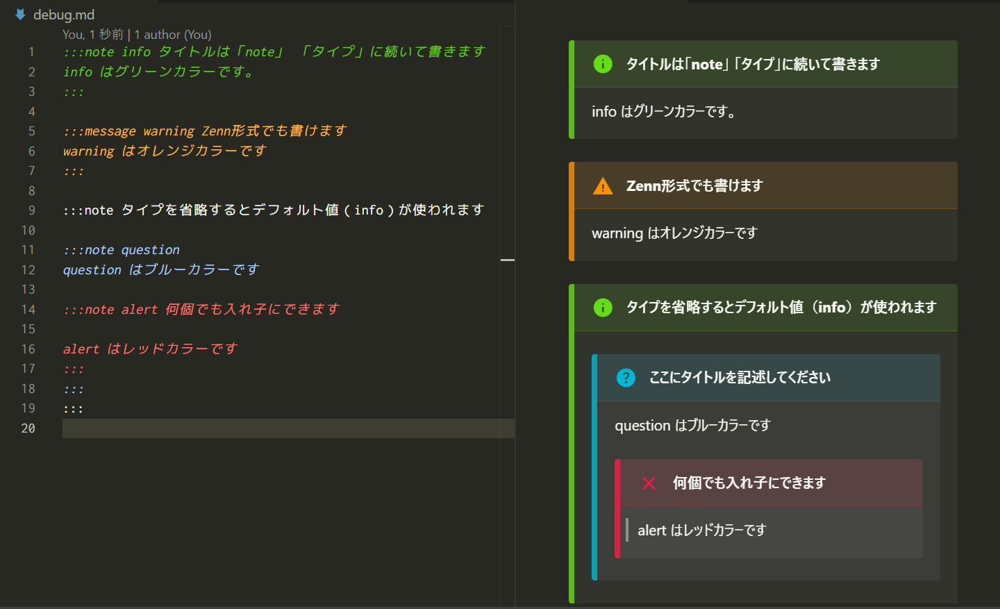
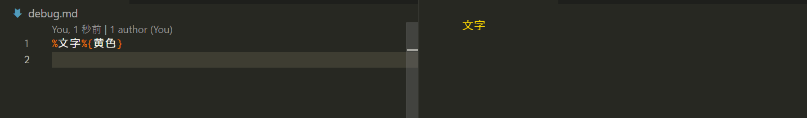

# Monokai Yusu79

[Here is the English version of the "README"](https://github.com/yusu79/vscode-monokai-yusu79/blob/main/README.en.md)

Visual Studio Code用に設計されたカスタムテーマで、Monokai配色をベースにしています。このテーマは特定のMarkdownプラグインをサポートし、コーディング体験を向上させます。

<!-- omit in toc -->
## 目次
- [インストール](#インストール)
- [対応しているシンタックスハイライト](#対応しているシンタックスハイライト)

## インストール
VScodeのマーケットプレイスで「**Monokai Yusu79**」と入力してください｡

## 対応しているシンタックスハイライト
以下のシンタックスハイライトに対応しています。

| プラグイン                                                                                   | 入力                       |
| -------------------------------------------------------------------------------------------- | -------------------------- |
| [markdown-it-info](https://www.npmjs.com/package/markdown-it-info)                 | `:::note info タイトル`               |
| [markdown-it-mojicolor](https://www.npmjs.com/package/markdown-it-mojicolor)                 | `%文字%{色}`               | 

### markdown-it-info

`:::note info タイトル`のように書くと、Infoボックスが生成されるプラグインです。

各タイプに合わせて色を変更しました。

### markdown-it-mojicolor

`%文字%{黄色}`とすることで、`文字`のように指定した色がレンダリングされるプラグインです。

記号部分をオレンジにしました。

